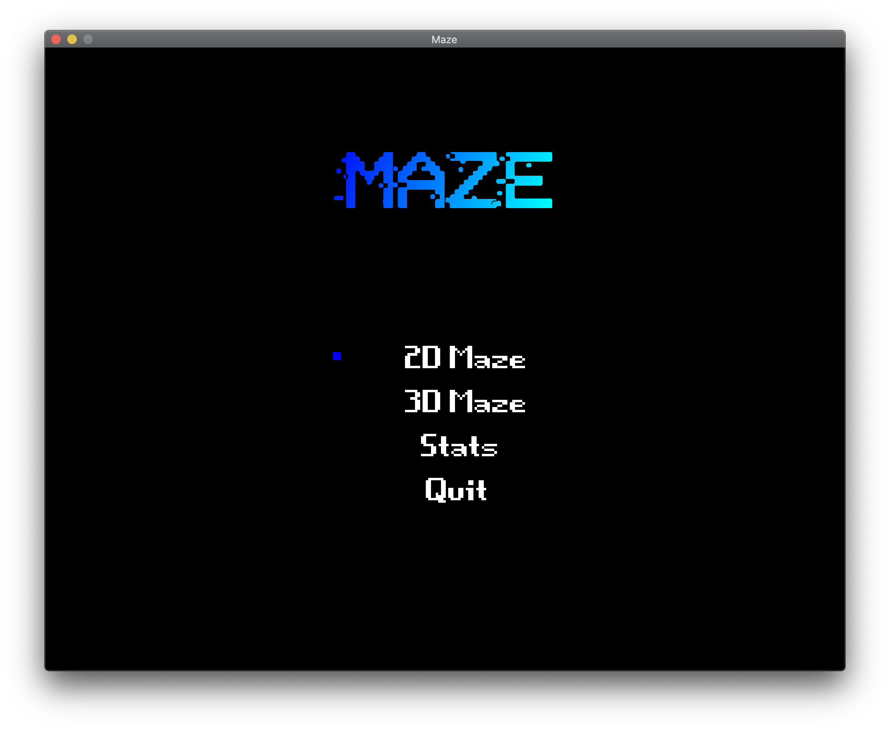
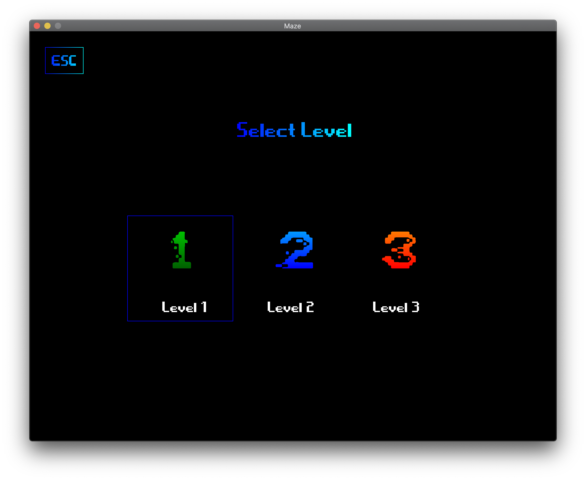
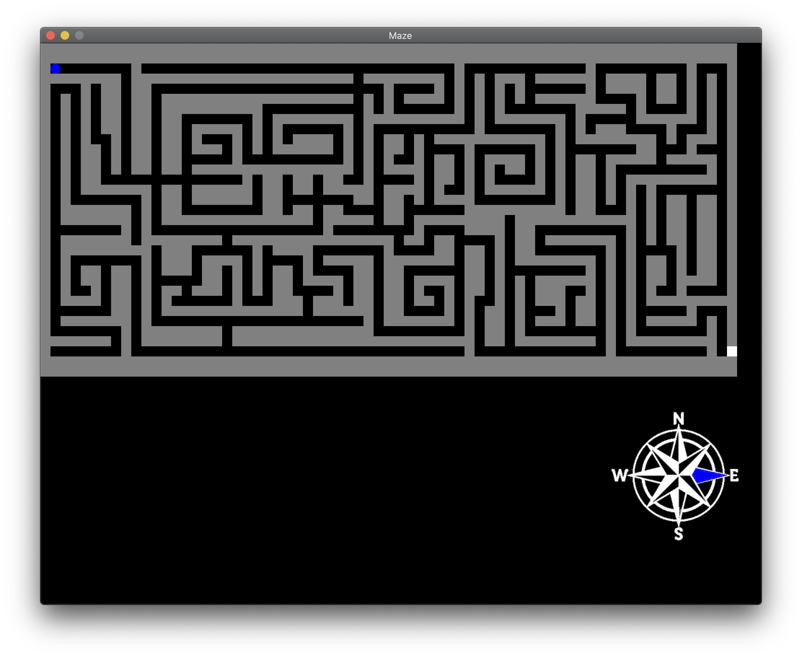
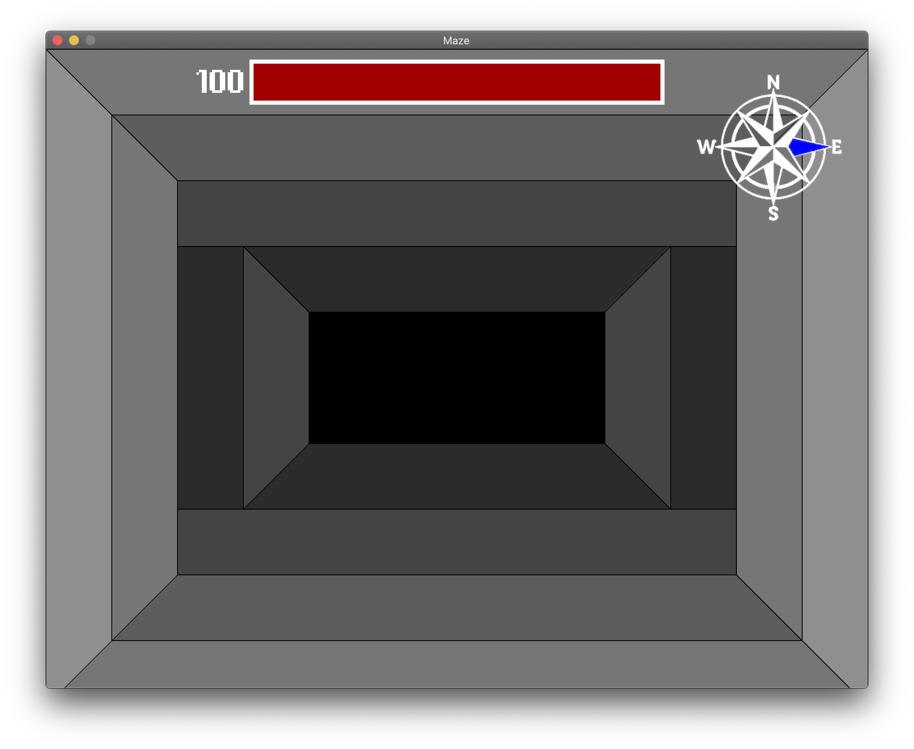

# Maze2

This maze game was created for a project in CS Topics: Data Structures and Game Design and is building off of my first maze game for my AP Computer Science A final.

Run `Main.java` to play.

This game includes both 2D and 3D mazes. There are 3 different maps in total. Each map is progressively more difficult than the last.

### 2D Maze
The 2D maze is simple: just reach the end of the maze (marked with a white square). 

### 3D Maze
The 3D maze has the same goal as the 2D maze, but you will gradually run out of light. When the light level is too low, you will start taking damage. There is a compass to help you. 

### Statistics
The game keeps track of your best time, least number of moves, number of wins, and number of losses for each map for both the 2D and 3D mazes. 

---

## Controls

* Navigate menus with the *arrow keys*.
* Press `ENTER` to select an item.
* Press `ESC` to go back.
* Press the *up arrow key* to move forward 1 space.
* Press the *left and right arrow keys* to turn left and right, respectively. 
* Press `ESC` while in a map to pause the game.

---

## Screenshots

### Main Menu

### Level Select

### 2D Maze

### 3D Maze

